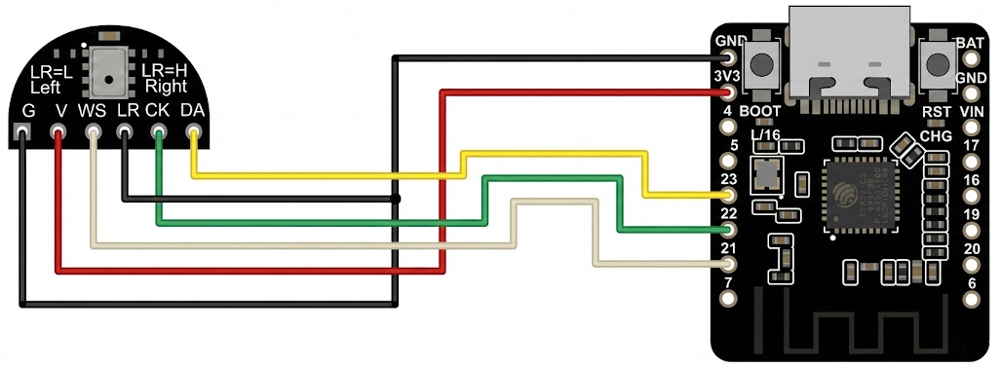
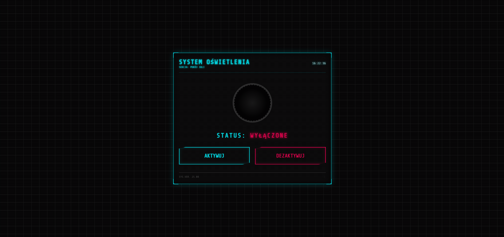

# 👏 Zigbee Light Controller

A custom-built smart home controller running on the DFRobot Beetle ESP32-C6. It listens for claps or commands from a local website to control a Sonoff Zigbee Switch. It runs completely locally using Zigbee and WiFi.

## 🔦 The "Why"
I built this because my girlfriend, Jula, is too lazy to get out of bed to turn off the lights (well, I'm too lazy too). Now she can just clap three times and boom, darkness. If clapping is too much effort, she can also control it via a Web Interface from her phone.

## 🛠️ Hardware
- MCU: DFRobot Beetle ESP32-C6 V1.1 (Ultra-compact RISC-V board with native Zigbee).
- Mic: DFRobot SEN0327.
- Target: Sonoff ZBMINI-L2 (No Neutral Wire Zigbee Relay) - hidden behind the wall switch!

## ⚡ Hardware Setup & Wiring (Important!)
Before flashing, ensure your hardware is set up correctly:
1. Microphone Connection: Connect the SEN0327 to the Beetle ESP32-C6 - refer to the provided schematic/image below:
     
2. Sonoff Installation:
    * WARNING: The Sonoff ZBMINI-L2 involves working with High Voltage (110V/230V).
    * It must be installed behind your wall switch or near the light bulb.
    * Ensure power is OFF at the breaker before installing the Sonoff!

## ⚙️ How it works
1. Audio Analysis: The code continuously reads audio levels from the microphone. It filters background noise and detects loud impulses (claps).
2. Logic: If 3 valid claps are detected within a specific time window (e.g., 5 seconds), it triggers the action.
3. Zigbee: The ESP32 acts as a Zigbee Coordinator. It sends explicit On or Off commands to the bound Sonoff.
4. Web Interface & WiFi: The board connects to WiFi and hosts a cyberpunk-themed web interface (`http://light.local`). You can use it to control the light manually if you don't feel like clapping.

## 🚀 Installation
1. Clone the repo.
2. Open in VS Code with PlatformIO.
3. Configuration:
    - Open `include/Constants.h`.
    - Enter your WiFi credentials in `ssid` and `password`.
    - Adjust `NOISE_THRESHOLD_START` and `MIN_AMPLITUDE_FOR_IMPULSE` (Line 14 & 17) to match your microphone sensitivity and environment.
4. Build and Upload to the Beetle ESP32-C6.
5. Open the Serial Monitor to see debug logs and the IP address (Note: You may need to uncomment specific Serial print lines in the code to see debug info).

## 🖱️ Usage
- Pairing: Hold the BOOT button on the Beetle while powering on to open the Zigbee network for pairing. Put the Sonoff ZBMINI-L2 into pairing mode (usually by holding its button for 5s or flipping the light switch on and off several times).
- Control (Sound): Clap 3 times to switch the light.
- Control (WiFi): Connect to `http://light.local` and click the On/Off button.

## ⚠️ Known Issues
PlatformIO on Windows: Path too long
PlatformIO often fails on Windows because build paths exceed the 260-character limit.
Fixes:
1. Shorten Path: Set a system environment variable `PLATFORMIO_CORE_DIR` to a short path like `C:\pio`.
2. Enable Long Paths:
   - Open Registry Editor (`regedit`).
   - Navigate to `HKEY_LOCAL_MACHINE\SYSTEM\CurrentControlSet\Control\FileSystem`.
   - Set `LongPathsEnabled` to 1.
   - Restart your computer.

## 📺 Demo

## 🖼️ UI Screenshot

> Note: The web interface was generated by AI and slightly modified by me. This allowed me to focus fully on the C++ logic, Zigbee communication, and hardware integration.

## 💻 Software Stack
* Platform: PlatformIO (VS Code)
* Framework: Arduino (using `pioarduino/platform-espressif32`)
* Hardware: ESP32-C6 (RISC-V)
* Connectivity: Zigbee (ZBOSS Stack) & WiFi

---
*Built by Bartek.*
