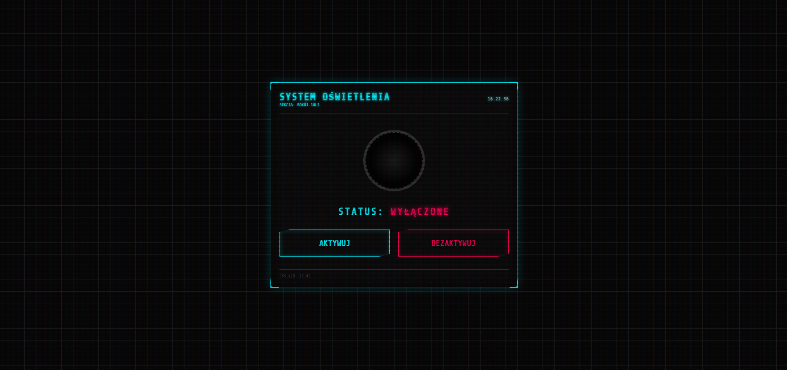

# Zigbee Light Controller (Dual MCU Edition)

This is a custom-built smart home controller now running on two microcontrollers: an **ESP32-C6** and an **ESP8266**. It listens for claps or commands from a local website to control a Sonoff Zigbee Switch. It runs completely locally using Zigbee and WiFi.

## The "Why"
I built this because my girlfriend, Jula, is too lazy to get out of bed to turn off the lights (well, I'm too lazy too). Now she can just clap three times and boom, darkness. If clapping is too much effort, she can also control it via a Web Interface from her phone.

## Hardware & Architecture
The project has been split into two dedicated boards communicating via UART for better stability and performance:

1. **ESP32-C6 (Beetle V1.1)**:
   - **Role:** Handles Zigbee Coordination and Audio Analysis.
   - **Hardware attached:** DFRobot SEN0327 Microphone.
   - **Target:** Sonoff ZBMINI-L2 (No Neutral Wire Zigbee Relay).
2. **ESP8266 (NodeMCU/Wemos)**:
   - **Role:** Handles WiFi connection, mDNS, and hosting the Web Server.

### Hardware Setup & Wiring (Important!)
Before flashing, ensure your hardware is set up correctly:

1. **Microphone (ESP32-C6)**: 
   - Connect the SEN0327 to the Beetle ESP32-C6 (check `esp32c6-firmware/include/Constants.h` for I2S pins: WS=21, SD=23, SCK=22).
2. **UART Connection (ESP32-C6 <-> ESP8266)**:
   - Connect **ESP32-C6 TX (Pin 4)** to **ESP8266 RX** (Hardware RX pin).
   - Connect **ESP32-C6 RX (Pin 5)** to **ESP8266 TX** (Hardware TX pin).
   - Make sure to connect **GND** between both boards!
3. **Sonoff Installation**:
   - WARNING: The Sonoff ZBMINI-L2 involves working with High Voltage (110V/230V).
   - It must be installed behind your wall switch or near the light bulb.
   - Ensure power is OFF at the breaker before installing the Sonoff!

## How it works
1. **Audio Analysis (ESP32-C6)**: Continuously reads audio levels from the I2S microphone, filtering background noise and detecting valid clap patterns.
2. **Zigbee Control (ESP32-C6)**: Acts as a Zigbee Coordinator and sends On/Off commands to the bound Sonoff switch.
3. **Web Interface (ESP8266)**: Connects to your local WiFi network and hosts a cyberpunk-themed web interface.
4. **Inter-MCU Communication**: When a clap pattern is detected, the ESP32-C6 toggles the light and sends the new state over UART to the ESP8266 so the web UI stays in sync. When you use the web UI, the ESP8266 sends a command to the ESP32-C6 to toggle the light via Zigbee.

## Installation & Flashing
Since the project is now split, you must flash both boards separately.

### 1. ESP8266 (Web Server / WiFi)
1. Navigate to the `esp8266-firmware` directory.
2. Open `include/Constants.h` and enter your WiFi credentials (`ssid` and `password`).
3. Build and upload to your ESP8266.

### 2. ESP32-C6 (Zigbee / Clap Detection)
1. Navigate to the `esp32c6-firmware` directory.
2. Adjust audio constants in `include/Constants.h` if needed.
3. Build and upload to your ESP32-C6.

## Usage
- **Pairing Zigbee:** Hold the BOOT button on the ESP32-C6 (check `BUTTON_PIN` in `Constants.h`) while powering on to open the Zigbee network for pairing. Put the Sonoff ZBMINI-L2 into pairing mode (usually by holding its button for 5s or flipping the light switch on and off several times).
- **Control (Sound):** Clap 3 times to switch the light.
- **Control (WiFi):** Open `http://light.local` on a device connected to the same network and click the On/Off button.

## Known Issues
- **PlatformIO on Windows (Path too long):** Fix by setting `PLATFORMIO_CORE_DIR` to a short path like `C:\pio` or enabling long paths in Windows Registry.

## UI Screenshot

> Note: The web interface was generated by AI and slightly modified by me. This allowed me to focus fully on the C++ logic, Zigbee communication, and hardware integration.

## 💻 Software Stack
* **Platform:** PlatformIO (VS Code)
* **Framework:** Arduino
* **Hardware:** ESP32-C6 (RISC-V) & ESP8266
* **Connectivity:** UART, Zigbee (ZBOSS Stack) & WiFi

---
*Built by Bartek.*
